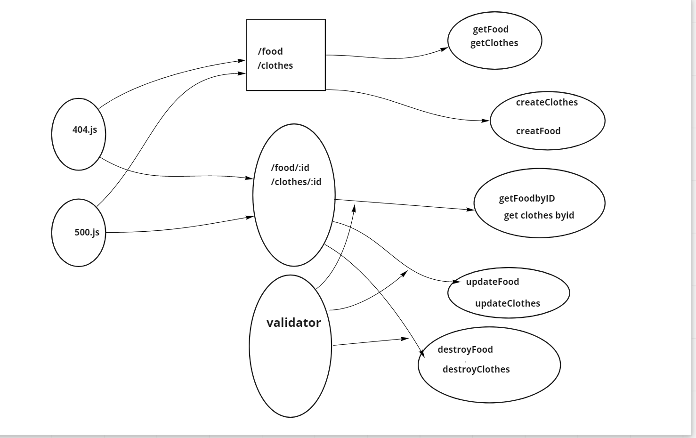

# basic-api-server

## Project: Express

### Author: Rula alqasem

### Links and Resources

- [GitHub Actions](https://github.com/RulaAlqasem/basic-api-server/actions)
- [Pull Request](https://github.com/RulaAlqasem/basic-api-server/pull/1)
- [HEROKU App](https://rrr5643.herokuapp.com/)

### Setup

#### `.env` requirements (where applicable)

- `PORT` - 3000

#### How to initialize/run your application (where applicable)

- `nodemon`
- `node index.js`
- `npm start`

#### Tests

- 404 on a bad route
- 404 on a bad method
- Create a record using POST
- Read a list of records using GET
- Read a record using GET
- Update a record using PUT
- Destroy a record using DELETE

### UML

